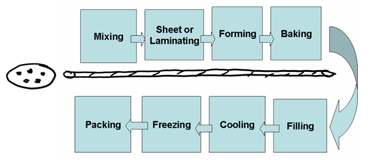
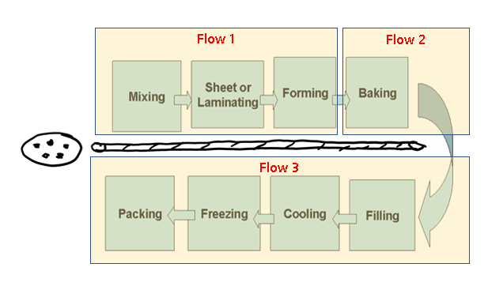

# Challenge

Given a set up for an intergalactic cookie oven, recommend an architecture to improve the productivity and resilience. Please document any assumptions and limitations, roles needed and effective timescales to deploy on your favourite cloud provider. Please note that the architecture depicted is a reference architecture and certain components may vary or be replaced in the future. All the components will be supported by appropriate software-based end points. Emphasis will be given on customer satisfaction. 
 
 

# Solution

Assumptions
Only a single oven used for baking. 

On checking the flow, none of the steps can be set to run in parallel. So in order to improve productivity, I would suggest creating 3 main workflows:

1 - Mixing, Sheet or Laminating, Forming

2 - Baking

3 - Filling, Forming, Cooling, Freezing, Packing

 

Once #1 is completed, we can start with the new batch of preparing the dough (#1) while #2 is in progress.
Once #2 is completed, #3 can be started. Also the second batch of #1 should be ready fr #2 t begin. And again #1 can start in parallel.
This way, the oven will not be idle until the doughs are ready(except for the first instance). The same goes for the packaging section.

## Potential bottlenecks
If the subsequent batch of #1 cookie doughs are ready before #2 baking is completed, the cookie dough can be chilled in freezer until the oven is ready.
This helps the cookie to spread less, and develop a rich chewy texture, while allowing the butter in the dough to firm up well before baking. 
Introducing another oven an result in increaded costs, but can improve the throughput by having multiple ovens baking in parallel.

Deploying to azure can be done through the App Service. Can be done within a weeks time frame. This excludes error handling and logging.

### Prerequisites

.net framework needs to be present

## Authors

Soshan Fernandes